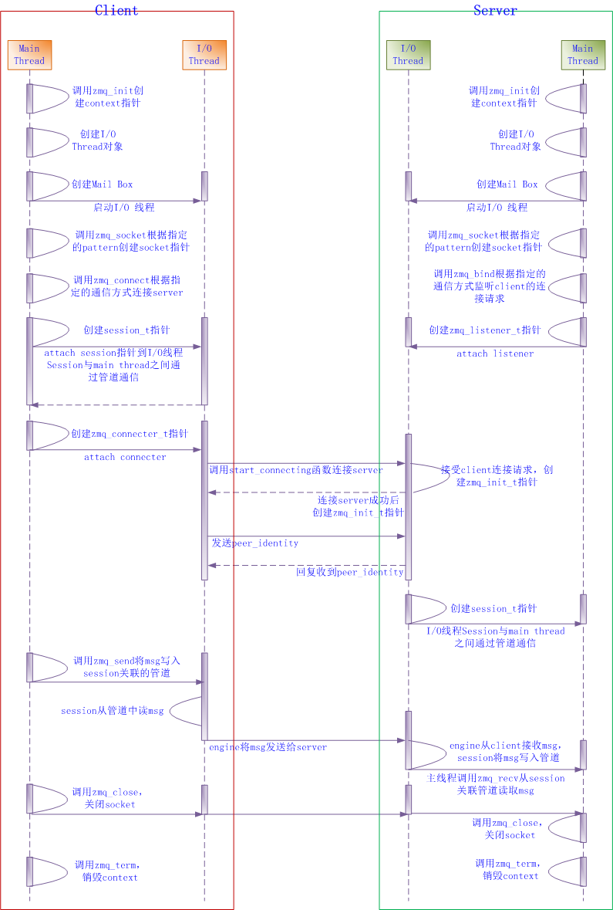

## 需要解决的问题

> 任何可重用的消息层都需要解决全部或大部分以下问题：

* 我们如何处理I/O？你的程序阻塞吗，还是在后台处理I/O？这是设计上的一个关键。阻塞I/O创建的架构不能很好扩展。但是后台I/O要做好是非常困难的。
* 我们如何处理动态组件，就是会暂时离开的部分？我们是否要在形式上将组件划分为“客户端”和“服务器”，并要求服务器不能消失？那如果我们想要服务器连接服务器怎么办？我们是否要每隔几秒就尝试重新连接？
* 我们如何表述线上的消息？我们如何将数据组帧才能让它易写易读，缓冲溢出也很安全，对小型消息也很高效，又能够胜任关于戴着狂欢帽的跳舞猫的超大视频？
* 无法立刻投递的消息我们又如何处理？尤其是正当我们等着一个组件回到在线状态？我们是放弃消息，扔到数据库里，还是放到一个内存队列中？
* 我们把消息队列存到哪儿去？如果组件从队列读取的速度很慢导致队列堆积是什么原因？这种情况下我们的对策又是什么？
* 丢失的消息我们如何处理？我们是等待新数据，请求重发，还是建造某种可靠性层来保证消息无法丢失？那如果这个层自身崩溃了又怎么办？
* 假设我们要使用不同的网络传输会如何。比如说，用多播来替代TCP单播？或者IPv6？我们需要重写程序吗，或者传输已经抽象到某个层了吗？
* 我们如何路由消息？我们能将同一消息发送到多个对等点吗？
* 我们如何写一个用于其它语言的API？我们是重新实现一个线路级协议还是重新打包一个库？如果是前者，如何保证效率和稳定堆叠？如果是后者，如何保证互用性？
* 我们如何表述数据让它能在不同架构间读取？我们要对数据类型强制一种特定编码吗？这是消息系统的工作吗，难道不该是更高层的事吗？
* 如何处理网络错误？我们是等待重试，悄然忽略，还是中断？

## ZeroMQ 详细设计

### 架构概览

ZeroMQ 几乎所有的 IO 操作都是异步的，每个 ZeroMQ IO 线程都有与之绑定的 Poller，Poller 采用经典的 Reactor 模式实现，Poller 会根据不同的操作系统平台使用不同的网络 IO 模型(select、poll、epoll、devpoll、kequeue等)。在 ZeroMQ 中，zmq_socket 也被看成是一个 ZMQ IO 线程。每个线程内含一个信箱 mailbox，用于线程与线程间传递命令。在创建 ZMQ IO 线程时，会把信箱句柄加到 Poller 中，用于监听是否有命令到达。当 client 端开始发起连接或者 server 端开始监听时，会在主线程创建 zmq_connector 或者 zmq_listener，主线程使用 zmq_socket 的 mailbox 发送命令给 IO 线程，将其（zmq_connector 或者 zmq_listener）绑定到 IO 线程中，IO 线程接收到命令后，会把 zmq_connector 或者 zmq_listener 含有的句柄加入 Poller 中，以侦听读写事件。Client 端与 Server 端都是通过 Session 来管理连接和通信，一个 session 代表一次会话，每个 Session 都会关联到相应的读/写管道，主线程收发消息只是分别从管道中读/写数据。Session 并不实际跟 kernel 交换 IO 数据，而是通过 plugin 到 Session 中的 Engine 来与 kernel 交换 IO 数据。


### 设计概述

基本流程图：




server 端主线程：


server 端 IO 线程：


### 线程模型

ZeroMQ 的线程分为一个主线程（用户线程），一个回收线程，以及若干 IO 线程。每一条线程都拥有一个 mailbox_t 用于接收命令。

从操作系统来看，ZMQ 中只有两种线程，应用线程和 IO 线程。应用线程在 ZMQ 外部创建，访问 ZMQ 的 API。IO 线程在 ZMQ 内部创建，用于在后台发送和接收消息。thread_t 是系统级线程的抽象，可以以 OS 无关的方式创建线程。

而从 ZMQ 的观点来看，线程只是一个拥有邮箱（mailbox_t）的对象。邮箱保存着发送给居住在当前线程上所有对象的信件（命令 command_t），所有这些对象公用线程上的邮箱。线程从邮箱中按序获取命令并交给其上的对象进行处理。

目前 ZMQ 内部使用两种不同类型的线程（拥有邮箱的对象）：IO 线程(io_thread_t)和 socket(socket_base_t)。

IO 线程很容易理解，每个 IO 线程与一个系统级线程一一对应。IO 线程运行在自己的系统线程上，并且拥有独立的获取命令的邮箱。

socket 在某种程度上显得复杂一些。每个 ZMQ socket 拥有自己的接收命令的邮箱，因此 socket 可被 ZMQ 视为分离线程。而实际上，一个应用程序线程可以创建多个套接字，也就是说多个 ZMQ socket 被映射到同一个系统线程。更加复杂的是，ZMQ socket 可以在系统线程之间迁移。例如，Java 语言绑定可以在单线程中使用 ZMQ socket，而当线程结束时，ZMQ socket 会传递给垃圾回收线程，并在垃圾回收线程上销毁。

> 在 ZMQ 内部，socket 线程并不是系统级别的线程（不是用 std::thread 创建的线程），而仅仅是一个继承于 socket_base_t 并且拥有邮箱（mailbox_t）的对象。

#### IO 线程

IO 线程(io_thread_t)是 ZMQ 异步处理网络 IO 的后台线程。它的实现非常简洁。io_thread_t 实现继承 object_t，并实现 i_poll_events 接口，其内部包含一个邮箱(mailbox_t)和一个 poller 对象(poller_t)。

继承 object_t 使得 io_thread_t 能够发送和接收 command（如 stop 命令，当收到该命令时，IO 线程将被终止）。

i_poll_events 接口定义了文件描述符和计时器事件就绪时的回调处理函数（in_event/out_event/timer_event）。io_thread_t 实现此接口(in_event)来处理来自mailbox 的事件。当 mailbox_t 事件触发时，IO 线程从 mailbox 中获取命令，并让命令的接收者进行处理。 

mailbox_t 用来存储发送给任何居住在 io_thread_t 上的 object_t 的命令，每个 io_thread_t 上有多个对象，这些对象共用同一个邮箱，邮箱的收件人就是对象。mailbox_t 本质是一个具有就绪通知功能的存储命令的队列。就绪通知机制由 signaler_t 提供的文件描述符实现。队列是由 ypipe_t 实现的无锁无溢出队列。

poller_t 是从不同操作系统提供的事件通知机制中抽象出来的概念，用来通知描述符和计时器事件，poller_t 通过 typedef 定义为操作系统首选的通知机制(select_t/poll_t/epoll_t 等)。所有运行在 io_thread_t 上的对象都继承自辅助类 io_object_t，该类实现了向 io_thread_t 注册/删除文件描述符  (add_fd/rm_fd) 和计时器 (add_timer/cancel_timer) 事件的功能，同时 io_object_t 还继承了 i_poll_events 接口来实现事件回调功能。

#### 回收线程

销毁任何一个指定的对象（包括socket）消耗的时间是不确定的。然而，我们希望 close 有类似于 POSIX 的行为：当关闭 TCP 套接字时，即使在后台还有没有完全发出的数据，调用也会立即返回。

所以，应用程序线程调用 close 时，ZMQ 应该关闭对应的套接字，但是，我们不能依赖应用线程来完成 socket 子对象的销毁（销毁可能需要多次命令交互）。同时应用线程调用 zmq_close 以后不会再继续使用该 socket，甚至可能永远不会再调用 ZMQ 库函数。因此，ZMQ socket 应该从应用线程迁移到一个工作线程来处理销毁的逻辑。一个可能的解决方案是将 socket 迁移到某个后台的 I/O 线程上去，然而 ZMQ 可以初始化为具有零个 IO 线程（适用于只在进程间通信的情况），因此，我们需要一个专门的回收线程来执行销毁任务。

回收线程由类 reaper_t 实现。socket 通过（send_reap）向回收线程发送回收命令，回收线程收到命令后会将 socket 从应用线程迁移到回收线程上，这样 socket 就可以在回收线程上处理命令(term/term_ack)，直到 socket 的所有子对象都成功销毁时，socket 就会在回收线程上销毁。实际上回收线程只是待回收对象驻留的线程，对象的处理逻辑仍然由对象自身处理。

### 全局状态

全局变量不适于在库中使用。因为一个进程可能会加载同一个库几次，而它们会共用一组全局变量。在下图中，ZMQ 库被两个不同的、彼此独立的库所调用，而应用本身调用了这两个库。


当出现这种情况时，两个 ZMQ 的实例会访问到相同的变量，这会产生竞争条件，出现奇怪的错误和未定义的行为。

要防止出现这种问题，ZMQ 中没有使用任何全局变量。相反地，是由库的使用者来负责显式地创建全局状态。包含全局状态的对象称为 `context`。从用户的角度来看，context 或多或少类似一个工作者线程池，而从 ZMQ 的角度来看，它仅仅是一个存储我们所需要的任意全局状态的对象。在上图中，libA 会有它自己的 context，而libB 也会有它自己的 context。它们之间无法互相干扰。

看到这里应该已经非常明显了：绝不要在库中使用全局状态。如果你这么做了，当库恰好需要在同一个进程中实例化两次时，它很可能会崩溃。

### 对象树模型

在 ZMQ 内部，对象在绝大多数情况下被组织成了树状层次结构。

参考：[ZeroMQ的内部架构(一) - 在思考的路上 - ITeye博客](https://www.iteye.com/blog/watter1985-1736023)

### ZMQ 类层次

* object_t：主要用于发送命令和处理命令，所有继承 object_t 的子类都具备该类的功能
* io_thread_t：内含一个 poller，可监听句柄的读、写、异常状态，继承自 object_t，具有接收命令、处理命令、发送命令的功能
* io_object_t：可以获取一个 io_thread_t 的 poller，从而具备 poller 功能，所有继承自该类的子类都具有 poller 功能，可监听句柄的读、写、异常状态
* reaper_t：ZMQ 的回收线程
* own_t：ZMQ 的对象树结点，或者说多叉树的结点，其主要用于对象的销毁，可以想到，对象的销毁就是这棵树的销毁过程，必须要使用深度优先的算法来销毁。关于 ZMQ 对象树在 [Internal Architecture of libzmq](http://zeromq.org/whitepapers:architecture) 有详细讲解
* tcp_connector_t：zmq_socket 的连接器，使用它来建立 tcp 连接
* tcp_listener_t：zmq_socket 的监听器
* stream_engine：负责处理 IO 事件中的一种网络事件，把网络字节流转换成 zeromq 的 msg_t 消息传递给 session_base_t。另外一些和版本兼容相关的杂务也stream_engine 处理的。stream_engine_t 处理完杂务，到 session_base_t 就只看见 msg_t 了
* session_base_t：管理 zmq_socket 的连接和通信，主要与 engine 进行交换
* socket_base_t：zeromq 的 socket，在 ZMQ 中，被当成一种特殊的“线程”，具有收发命令的功能

### 性能

三个因素会对性能产生严重影响：

* 内存分配的次数
* 系统调用的次数
* 并发模型

考虑到 ZMQ 被设计为针对长期连接的场景，因此建立一个连接或者处理一个连接错误所花费的时间基本上可忽略。这些事件极少发生，因此它们对总体性能的影响可以忽略不计。

代码库中某个一遍又一遍被频繁使用的部分，我们称之为关键路径。优化应该集中到这些关键路径上来。让我们看一个例子：ZMQ 在内存分配方面并没有做高度优化。比如，当操作字符串时，常常是在每个转化的中间阶段分配一个新的字符串。但是，如果我们严格审查关键路径——实际完成消息通信的部分——我们会发现这部分几乎没有使用任何内存分配。如果是短消息，那么每256个消息才会有一次内存分配（这些消息都被保存到一个单独的大内存块中）。此外，如果消息流是稳定的，在不出现流峰值的情况下，关键路径部分的内存分配次数会降为零（已分配的内存块不会返回给系统，而是不断的进行重用）。

我们从中学到的是：只在对结果能产生影响的地方做优化。优化非关键路径上的代码只是在做无用功。

#### 内存分配

假设所有的基础组件都已经初始化完成，两点之间的一条连接也已经建立完成，此时要发送一条消息时只有一样东西需要分配内存：消息体本身。因此，要优化关键路径，我们就必须考虑消息体是如何分配的以及是如何在栈上来回传递的。

对于小型的消息，拷贝操作比内存分配要经济的多。只要有需要，完全不分配新的内存块而直接把消息拷贝到预分配好的内存块上，这么做是有道理的。另一方面，对于大型的消息，拷贝操作比内存分配的开销又要昂贵的多。为消息体分配一次内存，然后传递指向分配块的指针，而不是拷贝整个数据。这种方式被称为“零拷贝”。

ZMQ 以透明的方式同时处理这两种情况。一条 ZMQ 消息由一个不透明的句柄来表示。对于非常短小的消息，其内容被直接编码到句柄中。因此，对句柄的拷贝实际上就是对消息数据的拷贝。当遇到较大的消息时，它被分配到一个单独的缓冲区内，而句柄只包含一个指向缓冲区的指针。对句柄的拷贝并不会造成对消息数据的拷贝，当消息有数兆字节长时，这么处理是很有道理的（见下图）。需要提醒的是，后一种情况里缓冲区是按引用计数的，因此可以做到被多个句柄引用而不必拷贝数据。


我们从中学到的是：当考虑性能问题时，不要假设存在有一个最佳解决方案。很可能这个问题有多个子问题（例如，小型消息和大型消息），而每一个子问题都有各自的优化算法。

#### 批量处理

前面已经提到过，在消息通信系统中，系统调用的数量太多的话会导致出现性能瓶颈。实际上，这个问题绝非一般。当需要遍历调用栈时会有不小的性能损失，因此，明智的做法是，当创建高性能的应用时应该尽可能多的去避免遍历调用栈。

参考下图，为了发送 4 条消息，你不得不遍历整个网络协议栈4次（也就是，ZMQ、glibc、用户/内核空间边界、TCP实现、IP实现、以太网链路层、网卡本身，然后反过来再来一次）。


但是，如果你决定将这些消息集合到一起成为一个单独的批次，那么就只需要遍历一次调用栈了（见下图）。这种处理方式对消息吞吐量的影响是巨大的：可大至2个数量级，尤其是如果消息都比较短小，数百个这样的短消息才能包装成一个批次。


另一方面，批量处理会对时延带来负面影响。我们来分析一下，比如，TCP 实现中著名的 Nagle 算法。它为待发出的消息延迟一定的时间，然后将所有的数据合并成一个单独的数据包。显然，数据包中的第一条消息，其端到端的时延要比最后一条消息严重的多。因此，如果应用程序需要持续的低时延的话，常见做法是将 Nagle 算法关闭。更常见的是取消整个调用栈层次上的批量处理（比如，网卡的中断汇聚功能）。

但同样，不做批量处理就意味着需要大量穿越整个调用栈，这会导致消息吞吐量降低。似乎我们被困在吞吐量和时延的两难境地中了。

ZMQ 尝试采用以下策略来提供一致性的低时延和高吞吐量。当消息流比较稀疏，不超过网络协议栈的带宽时，ZMQ 关闭所有的批量处理以改善时延。这里的权衡是CPU的使用率会变得略高——我们仍然需要经常穿越整个调用栈。但是在大多数情况下，这并不是个问题。

当消息的速率超过网络协议栈的带宽时，消息就必须进行排队处理了————保存在内存中直到协议栈准备好接收它们。排队处理就意味着时延的上升。如果消息在队列中要花费1秒时间，端到端的时延就至少会达到1秒。更糟糕的是，随着队列长度的增长，时延会显著提升。如果队列的长度没有限制的话，时延就会超过任何限定值。

据观察，即使调整网络协议栈以追求最低的时延（关闭 Nagle 算法，关闭网卡中断汇聚功能，等等），由于受前文所述的队列的影响，时延仍然会比较高。

在这种情况下，积极的采取批量化处理是有意义的。反正时延已经比较高了，也没什么好顾虑的了。另一方面，积极的采用批量处理能够提高吞吐量，而且可以清空队列中等待的消息————这反过来又意味着时延将逐步降低，因为正是排队才造成了时延的上升。一旦队列中没有未发送的消息了，就可以关闭批量处理，进一步的改善时延。

我们观察到批量处理只应该在最高层进行，这是需要额外注意的一点。如果消息在最高层汇聚为批次，在低层次上就没什么可做批量处理的了，而且所有低层次的批量处理算法除了会增加总体时延外什么都没做。

我们从中学到了：在一个异步系统中，要获得最佳的吞吐量和响应时间，需要在调用栈的底层关闭批量处理算法，而在高层开启。仅在新数据到达的速率快于它们被处理的速率时才做批量处理。

#### 并发模型

ZMQ 需要充分利用多核的优势，换句话说就是随着 CPU 核心数的增长能够线性的扩展吞吐量。

以我们之前对消息通信系统的经验表明，采用经典的多线程方式（临界区、信号量等等）并不会使性能得到较大提升。事实上，就算是在多核环境下，一个多线程版的消息通信系统可能会比一个单线程的版本还要慢。有太多时间都花在等待其他线程上了，同时，引入了大量的上下文切换拖慢了整个系统。

针对这些问题，我们决定采用一种不同的模型。目标是完全避免锁机制，并让每个线程能够全速运行。线程间的通信是通过在线程间传递异步消息（事件）来实现的。内行人都应该知道，这就是经典的 actor 模式。

我们的想法是在每一个CPU核心上运行一个工作者线程————让两个线程共享同一个核心只会意味着大量的上下文切换而没有得到任何别的优势。每一个 ZMQ 的内部对象，比如说 TCP engine，将会紧密地关联到一个特定的工作者线程上。反过来，这意味着我们不再需要临界区、互斥锁、信号量等等这些东西了。此外，这些 ZMQ 对象不会在CPU 核之间迁移，从而可以避免由于缓存被污染而引起性能上的下降。

这个设计让很多传统多线程编程中出现的顽疾都消失了。然而，我们还需要在许多对象间共享工作者线程，这反过来又意味着必须要有某种多任务间的合作机制。这表示我们需要一个调度器，对象必须是事件驱动的，而不是在整个事件循环中来控制。我们必须考虑任意序列的事件，甚至非常罕见的情况也要考虑到。我们必须确保不会有哪个对象持有CPU的时间过长等等。

简单来说，整个系统必须是全异步的。任何对象都无法承受阻塞式的操作，因为这不仅会阻塞其自身，而且所有共享同一个工作者线程的其他对象也都会被阻塞。所有的对象都必须或显式或隐式的成为一种状态机。随着有数百或数千的状态机在并行运转着，你必须处理这些状态机之间的所有可能发生的交互，而其中最重要的就是————关闭过程。

事实证明，要以一种清晰的方式关闭一个全异步的系统是一个相当复杂的任务。试图关闭一个有着上千个运转着的部分的系统，其中有的正在工作中，有的处于空闲状态，有的正在初始化过程中，有的已经自行关闭了，此时极易出现各种竞态条件、资源泄露等诸如此类的情况。ZMQ 中最为复杂的部分肯定就是这个关闭子系统了。快速检查一下bug 跟踪系统的记录显示，约 30% 到 50% 的 bug 都同关闭有某种联系。

我们从中学到的是：当要追求极端的性能和可扩展性时，考虑采用 actor 模型。在这种情况下这几乎是你唯一的选择。不过，如果不使用像 Erlang 或者 ZMQ 这种专门的系统，你将不得不手工编写并调试大量的基础组件。此外，从一开始就要好好思考关于系统关闭的步骤。这将是代码中最为复杂的部分，而如果你没有清晰的思路该如何实现它，你可能应该重新考虑在一开始就使用 actor 模型。

#### 无锁队列

最近比较流行使用无锁算法。它们是用于线程间通信的一种简单机制，同时并不会依赖于操作系统内核提供的同步原语，如互斥锁和信号量。相反，它们通过使用CPU原子操作来实现同步，比如原子化的 CAS 指令（比较并交换）。我们应该理解清楚的是它们并不是字面意义上的无锁一一相反，锁机制是在硬件层面实现的。

ZMQ 在 pipe 对象中采用无锁队列来在用户线程和 ZMQ 的工作者线程之间传递消息。关于 ZMQ 是如何使用无锁队列的，这里有两个有趣的地方。

首先，每个队列只有一个写线程，也只有一个读线程。如果有1对多的通信需求，那么就创建多个队列（如下图）。鉴于采用这种方式时队列不需要考虑对写线程和读线程的同步（只有一个写线程，也只有一个读线程），因此可以以非常高效的方式来实现。


其次，尽管我们意识到无锁算法要比传统的基于互斥锁的算法更加高效，CPU 的原子操作开销仍然非常高昂（尤其是当 CPU 核心之间有竞争时），对每条消息的读或者写都采用原子操作的话，效率将低于我们所能接受的水平。

提高速度的方法————再次采用批量处理。假设你有10条消息要写入到队列。比如，可能会出现当你收到一个网络数据包时里面包含有10条小型的消息的情况。由于接收数据包是一个原子事件，你不能只接收一半，因此这个原子事件导致需要写10条消息到无锁队列中。那么对每条消息都采用一次原子操作就显得没什么道理了。相反，你可以让写线程拥有一块自己独占的“预写”区域，让它先把消息都写到这里，然后再用一次单独的原子操作，整体刷入队列。

同样的方法也适用于从队列中读取消息。假设上面提到的10条消息已经刷新到队列中了。读线程可以对每条消息采用一个原子操作来读取，但是，这种做法过于重量级了。相反，读线程可以将所有待读取的消息用一个单独的原子操作移动到队列的“预读取”部分。之后就可以从“预读”缓存中一条一条的读取消息了。“预读取”部分只能由读线程单独访问，因此这里没有什么所谓的同步需求。

下图左边的箭头展示了如何通过简单地修改一个指针来将预写入缓存刷新到队列中的。右边的箭头展示了队列的整个内容是如何通过修改另一个指针来移动到预读缓存中的。


我们从中学到的是：发明新的无锁算法是很困难的，而且实现起来很麻烦，几乎不可能对其调试。如果可能的话，可以使用现有的成熟算法而不是自己来发明轮子。当需要追求极度的性能时，不要只依靠无锁算法。虽然它们的速度很快，但可以在其之上通过智能化的批量处理来显著提高性能。

### 消息模式

ZeroMQ 并不是一个对 socket 的封装，不能用它去实现已有的网络协议。它有自己的模式，不同于更底层的点对点通讯模式。它有比 tcp 协议更高一级的协议。（当然 ZeroMQ 不一定基于 TCP 协议，它也可以用于进程间和进程内通讯）。它改变了通讯都基于一对一的连接这个假设。

ZeroMQ 把通讯的需求看成四类。其中一类是一对一结对通讯，用来支持传统的 TCP socket 模型，但并不推荐使用。常用的通讯模式只有三类：

1. **请求回应模型（REQ-REP）**。由请求端发起请求，并等待回应端回应请求。从请求端来看，一定是一对收发配对的；反之，在回应端一定是发收对。请求端和回应端都可以是 1:N 的模型。通常把 1 认为是 server ，N 认为是 Client 。ZeroMQ 可以很好的支持路由功能（实现路由功能的组件叫作 Device），把 1:N 扩展为 N:M （只需要加入若干路由节点）。从这个模型看，更底层的端点地址是对上层隐藏的。每个请求都隐含有回应地址，而应用则不关心它。
2. **发布订阅模型（PUB-SUB）**。这个模型里，发布端是单向只发送数据的，且不关心是否把全部的信息都发送给订阅端。如果发布端开始发布信息的时候，订阅端尚未连接上来，这些信息直接丢弃。不过一旦订阅端连接上来，中间会保证没有信息丢失。同样，订阅端则只负责接收，而不能反馈。如果发布端和订阅端需要交互（比如要确认订阅者是否已经连接上），则使用额外的 socket 采用请求回应模型满足这个需求。
3. **管道模型（PUSH-PULL）**。这个模型里，管道是单向的，从 PUSH 端单向的向 PULL 端单向的推送数据流。

以下是合法的套接字连接-绑定对（一端绑定、一端连接即可）：

* REQ - REP
* REQ - ROUTER
* DEALER - REP
* DEALER - ROUTER
* DEALER - DEALER
* ROUTER - ROUTER
* PUB - SUB
* PUSH - PULL
* PAIR - PAIR

任何分布式，并行的需求，都可以用这三种模型组合起来解决问题。ZeroMQ 只专注和解决了消息通讯这一基本问题。

基于定义好的模型，我们可以看到，api 可以实现的非常简单易用。我们不再需要 bind/listen/accept 来架设服务器，因为这个模型天然是 1:N 而不是 1:1 的，不需要为每个通道保留一个句柄。我们也不必在意 server 是否先启动（bind），而后才能让 client 工作起来（connect）。

这以上模型中，关注的是通讯双方的职责，而不是实现的方式：监听端口还是连接对方端口。对于复杂的多进程协同工作的系统, 不必纠结于进程启动的次序。

使用 ZeroMQ 不必在意底层实现是使用短连接还是长连接方式。ZeroMQ 中的 Transient (短暂) 和 Durable (持久) socket 也并非区别于实现层是否保持了 tcp 连接。而是概念上的不同。对于 Durable socket ，其生命期可以长于一个进程的生命期，即使进程退出，再次启动后依旧可以维持继续之前的 socket。当然，这并不是帮助你挽救你的程序因出错而崩溃的。它只是提出这个模式，让你根据设计需要可以实现。对于 ZeroMQ，如有需求（若内存有限），甚至把数据传输的 buffer 放到磁盘上。

> 还有一种模式是为那些仍然认为 ZMQ 是类似 TCP 那样点对点连接的人们准备的：**排他对接模式** 将两个套接字一对一地连接起来，这种模式应用场景很少

### 传输方式

ZeroMQ 支持多种传输方式：

* tcp: 使用 TCP 的单播传输
* ipc: 本地进程间通信
* inproc: 本地进程内(线程间)通信
* tipc: 基于 TIPC 的单播传输。TIPC 是一个具有位置透明寻址方案的集群 IPC 协议
* pgm, epgm: 可靠组播。只能使用 `ZMQ_PUB` 和 `ZMQ_SUB` 类型的 socket
* vmci: 虚拟机通信接口
* udp: 使用 UDP 协议的不可靠单播和多播通信。只能使用 `ZMQ_RADIO` 和 `ZMQ_DISH` 类型的 socket
* norm
* ws、wss

> TCP: AF_INET/AF_INET6 socket
>
> IPC: AF_UNIX socket
>
> INPROC: pipe
>
> TIPC: AF_TIPC socket [TIPC协议和实现解析 - CodeAntenna](https://codeantenna.com/a/sXZphSQFNO)
>
> UDP: AF_INET/AF_INET6 socket

## ZeroMQ 的特点：

* 它在后台线程异步的处理 IO。这些后台线程使用无锁数据结构与程序线程交流，所以并发 ZMQ 程序不需要锁、信号量、或其它等待状态。
* 组件可以动态的来来去去，而 ZMQ 会自动重连。这意味着你可以按任意顺序启动组件。你可以创建“面向服务架构”（SOAs），服务可以随时加入和离开网络。
* 当需要时它自动将消息排入队列。以智能的方式，消息排入队列前推送消息到尽可能靠近接收者。
* 它有几种办法处理满溢队列（称为“高水位线”）。当队列填满时，ZMQ 自动阻塞发送者，或丢弃消息，取决于你用的消息传递方式（所谓的“模式”）。
* 它让你的程序用任意传输方式来相互交谈：TCP、多播、进程内、进程间。更改传输方式时无需更改代码。
* 安全处理低速/阻塞的读者，使用的是取决于消息传递模式的不同策略。
* 它让你路由消息使用各种模式如请求-应答和发布-订阅。这些模式是你创建拓扑、网络结构的方式。
* 它让你用一个调用就能创建代理来做队列、转发、或捕获消息。代理可以降低网络的互联复杂度。
* 它使用简单的线上组帧，转发整个消息并精确重现其发送时的样子。如果你写入一个10K的消息，就能接收一个10K的消息。
* 它不在消息上强加任何格式。消息就是零到千兆大小的二进制大对象。想要描述数据时你可以在其上选择一些其它产品，例如谷歌的协议缓冲（protocol buffers）、外部数据表示法（XDR）、或其它。
* 它智能的处理网络错误。有时它会重试，有时它告知你一个操作失败了。
* 它减少你的碳排放。用更低的CPU消耗做更多事意味着你的机子使用了更少的能源，并且可以让你的旧机器使用的更久。
* 使用简单
  * 仅仅提供 24 个 API 接口，风格类似于 BSD Socket。
  * 处理了网络异常，包括连接异常中断、重连等。
  * 改变TCP基于字节流收发数据的方式，处理了粘包、半包等问题，以msg为单位收发数据，结合Protocol Buffers，可以对应用层彻底屏蔽网络通信层。
  * 对大数据通过SENDMORE/RECVMORE提供分包收发机制。
  * 通过线程间数据流动来保证同一时刻任何数据都只会被一个线程持有，以此实现多线程的“去锁化”。
  * 通过高水位HWM来控制流量，用交换SWAP来转储内存数据，弥补HWM丢失数据的缺陷。
  * 服务器端和客户端的启动没有先后顺序。
* 灵活
  * 支持多种通信协议，可以灵活地适应多种通信环境，包括进程内、进程间、机器间、广播。
  * 支持多种消息模型，消息模型之间可以相互组合，形成特定的解决方案。

## 遗留问题

1. endpoint 是如何起作用的？使用相同的 endpoint 的 server 和 client 是如何相互识别的？
2. zmq 在什么时候会将消息写入到磁盘？
3. zmq_bind 两次为什么没有报错？
4. ZMQ 的 device 组件：传统的消息队列？已经被 zmq_proxy 替代
5. ZMQ 是如何处理粘包、半包的？
6. PAIR 套接字：线程间传输信号
7. 回收线程是如何工作的？
8. 重点内容：
   1. 请求响应模式在 TCP 传输方式下的各种实现技术细节以及高级应用
   2. 发布订阅模式在 TCP 传输方式下的各种实现技术细节以及高级应用
9. 扇出（fan-out）这种通信模式的实现细节
10. 广播？
11. 如何用 ZMQ 构建集群产品

## 可靠性设计

ZMQ 如何处理以下异常：

- 应用程序代码是最大的故障来源。程序会崩溃或中止，停止对数据来源的响应，或是响应得太慢，耗尽内存等。
- 系统代码，如使用ZMQ编写的中间件，也会意外中止。系统代码应该要比应用程序代码更为可靠，但毕竟也有可能崩溃。特别是当系统代码与速度过慢的客户端交互时，很容易耗尽内存。
- 消息队列溢出，典型的情况是系统代码中没有对慢客户端做积极的处理，任由消息队列溢出。
- 网络临时中断，造成消息丢失。这类错误ZMQ应用程序是无法及时发现的，因为ZMQ会自动进行重连。
- 硬件系统崩溃，导致所有进程中止。
- 网络会出现特殊情形的中断，如交换机的某个端口发生故障，导致部分网络无法访问。
- 数据中心可能遭受雷击、地震、火灾、电压过载、冷却系统失效等。

我们重点关注前五个异常

## 面试题

> epoll 水平触发模式下，当 socket 可写时，会不停的触发 EPOLLOUT 事件，如何处理？

有两种处理方式：

1. 需要向 socket 写数据的时候才监听 EPOLLOUT 事件，等待可写事件。EPOLLOUT 事件触发之后，调用 write 或者 send 发送数据。当所有数据都写完后，将 EPOLLOUT 事件从 内核监听队列删除。

   > 这种方式的缺点是，即使发送很少的数据，也要把 EPOLLOUT 事件加入内核监听队列，写完后再移出，有一定操作代价。

2. 刚开始不监听 EPOLLOUT 事件，需要向 socket 写数据的时候，直接调用 write 或者 send 发送数据。如果返回 EAGAIN，再将 EPOLLOUT 事件加入 epoll，等待 EPOLLOUT 事件触发之后，再去发送数据，全部数据发送完毕后，从内核监听队列中删除 EPOLLOUT 事件。

   > 这种方式的优点是：数据不多的时候可以避免 epoll 的事件处理，提高效率，避免 busy-loop

ZMQ 和 muduo 都是采用的第二种处理方案。

## 典型 demo

1. REQ/REP: test_reqrep_device.cpp、test_spec_req.cpp、test_probe_router

2. PUSH/PULL: test_immediate.cpp

3. PUB/SUB: test_sub_forward.cpp、test_hwm_pubsub.cpp

### ZeroMQ 中的信号处理

```cpp
static int s_interrupted = 0;
static void s_signal_handler (int signal_value)
{
    s_interrupted = 1;
}

static void s_catch_signals (void)
{
    struct sigaction action;
    action.sa_handler = s_signal_handler;
    action.sa_flags = 0;
    sigemptyset (&action.sa_mask);
    sigaction (SIGINT, &action, NULL);
    sigaction (SIGTERM, &action, NULL);
}
```


## 参考

* [<摘录>开源软件架构-ZeroMQ](https://www.cnblogs.com/hummersofdie/p/4597031.html)
* [业界消息总线技术分析-ZeroMQ-云社区-华为云 (huaweicloud.com)](https://bbs.huaweicloud.com/blogs/detail/104842)
* [ZeroMQ的内部架构(一) - 在思考的路上 - ITeye博客](https://www.iteye.com/blog/watter1985-1736023)

## 使用

### 源码编译

可以直接执行该脚本完成编译、运行测试运行以及安装等一系列步骤

```sh
./ci_build.sh
```

如果想单独编译，则可以执行以下命令。

```sh
mkdir build
cd build
cmake -DCMAKE_BUILD_TYPE=Debug ..		# 编译 debug 版本（默认是 release 版本）
make -j3
```

上面两种方式会同时编译出静态库和动态库，而单元测试优先链接动态库（这点可以在单元测试的 CMakeLists.txt L203 行中看到），而链接动态库不方便使用 gdb 进行调试。如果想让单元测试链接到静态库，则可以修改顶层 CMakeLists.txt 文件，让不生成动态库，则单元测试会链接静态库。修改内容如下：

```sh
# output
option(BUILD_SHARED "Whether or not to build the shared object" OFF)			# 改为 OFF 则意味着不生成动态库
option(BUILD_STATIC "Whether or not to build the static archive" ON)

if(NOT CMAKE_BUILD_TYPE AND NOT CMAKE_CONFIGURATION_TYPES)
  # CMAKE_BUILD_TYPE is not used for multi-configuration generators like Visual Studio/XCode which instead use
  # CMAKE_CONFIGURATION_TYPES
  set(CMAKE_BUILD_TYPE
      Release			# 这里也可以修改成 Debug，但是 DCMAKE_BUILD_TYPE 参数可以通过命令行传入，所以这里可以不修改
      CACHE STRING "Choose the type of build, options are: None Debug Release RelWithDebInfo MinSizeRel." FORCE)
endif()
```

